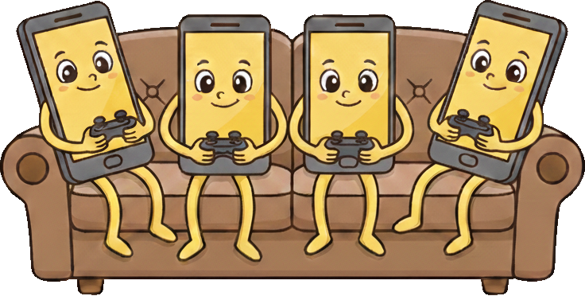

# TouchCoop

A TypeScript library that enables couch co-op gaming on the web, using mobile devices as controllers.



## Purpose

TouchCoop is designed to allow up to four players to connect to a game server using their mobile devices as controllers. Each player can use touch controls on their device to send input events to the game.

TouchCoop is intended for playing games on a TV or monitor, while players use their phones or tablets as controllers. 

TouchCoop is ideal for casual multiplayer games, such as platformers, puzzle games, or party games. TouchCoop is not intended for games that require low-latency input, such as first-person shooters.

TouchCoop does not require servers or user accounts. All communication is done using WebRTC, which allows for peer-to-peer connections between the players' devices.

## Installation

```bash
npm install touch-coop
```

## Usage

The library expects your game to use the `Match` and `Player` classes. Your game will require a minimum of two pages with unique URLs:

### 1. Match URL

The main game page hosts the game and creates a `Match` instance. This page uses `requestNewPlayerToJoin()` to generate a QR code for each player to join the game.

```ts
import { Match, PlayerEvent } from "touch-coop";

const gamePadURL = "http://localhost:8080/demos/gamepad";

function handlePlayerEvent(event: PlayerEvent) {
    switch (event.action) {
        case "JOIN":
            console.log(
                `Player ${event.playerId} joined the game.`
            );
            break;
        case "LEAVE":
            console.log(
                `Player ${event.playerId} left the game.`
            );
            break;
        case "MOVE":
            console.log(
                `Player ${event.playerId} pressed ${event.button}`
            );
            break;
        }
}


const match = new Match(
    gamePadURL,
    handlePlayerEvent
);
```

### 2. GamePad URL

Each player scans a QR code to join the game. The QR code contains a unique URL that opens a web page with touch controls. This page uses the `Player` class to connect to the game match with `player.joinMatch()` and send input events with `player.sendMove("X")`.

```ts
import React from "react";
import { Player } from "touch-coop";

const player = new Player();

export default function GamePad() {
    const [loading, setLoading] = React.useState(true);

    React.useEffect(() => {
        (async () => {
        await player.joinMatch();
            setLoading(false);
        })();
    }, []);

    if (loading) {
        return <div>Loading…</div>;
    }

    return (
        <div>
            <button onClick={() => player.sendMove("up")}>
                Up
            </button>
            <button onClick={() => player.sendMove("down")}>
                Down
            </button>
            <button onClick={() => player.sendMove("left")}>
                Left
            </button>
            <button onClick={() => player.sendMove("right")}>
                Right
            </button>
            <button onClick={() => player.sendMove("A")}>
                A
            </button>
            <button onClick={() => player.sendMove("B")}>
                B
            </button>
            <button onClick={() => player.sendMove("X")}>
                X
            </button>
            <button onClick={() => player.sendMove("Y")}>
                Y
            </button>
        </div>
    );
}
```

## Live Demo

You can try a live demo of TouchCoop at [https://SlaneyEE.github.io/touch-coop/demos/match.html](https://SlaneyEE.github.io/touch-coop/demos/match.html).

The demo contains a simple game where players can join by scaning a QR Code and use their mobile devices as controllers. Each player can use the on-screen buttons to send input events to the game.

The game page is [./demos/match.html](./demos/match.html). The QR code redirects players to [./demos/gamepad/index.html](./demos/gamepad/index.html).

You need to run a local server to host the demo files. You can use a simple HTTP server like `http-server` or `live-server` to serve the files from the `root` directory and then access `http://localhost:8080/demos/match.html` in your browser.
